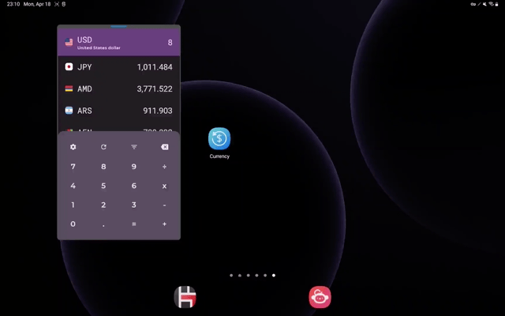

[](https://app.circleci.com/pipelines/github/dacer/JetCurrency)
[](https://github.com/dacer/JetCurrency/blob/master/LICENSE)

JetCurrency is a simple currency converter app built with Jetpack Compose.

(still under development 👷)

## Android development

JetCurrency is an app that attempts to use the latest libraries and tools. As a summary:

* Entirely written in [Kotlin](https://kotlinlang.org/).
* UI completely written in [Jetpack Compose](https://developer.android.com/jetpack/compose).
* [Material Design 3](https://m3.material.io/) theming and Material You dynamic color.
* Uses [Kotlin Coroutines](https://kotlinlang.org/docs/reference/coroutines/coroutines-guide.html) throughout.
* Uses [Architecture Components](https://developer.android.com/topic/libraries/architecture/), including: Room, ViewModel.
* Uses [Hilt](https://dagger.dev/hilt/) for dependency injection.

## Screenshots




## Download

<a href="https://play.google.com/store/apps/details?id=im.dacer.currency">
    
</a>

## Currencylayer API key

JetCurrency uses the [Currencylayer](https://currencylayer.com) to load exchange rate data.
To use the API, you will need to obtain a free developer API key. See the
[Currencylayer API Documentation](https://currencylayer.com/documentation) for instructions.

Once you have the key, add this line to the `gradle.properties` file, either in your user home
directory (usually `~/.gradle/gradle.properties` on Linux and Mac) or in the project's root folder:

```
currencylayer_access_key=<your Currencylayer access key>
```

## Credits

* [currency-flags](https://github.com/transferwise/currency-flags)
* [Flagpack](https://github.com/Yummygum/flagpack-core)
* [Cryptocurrency Icons](https://github.com/spothq/cryptocurrency-icons)  
* [Free Currency Rates API](https://github.com/fawazahmed0/currency-api)

## License

Licensed under the GPLv3: http://www.gnu.org/licenses/gpl-3.0.html
